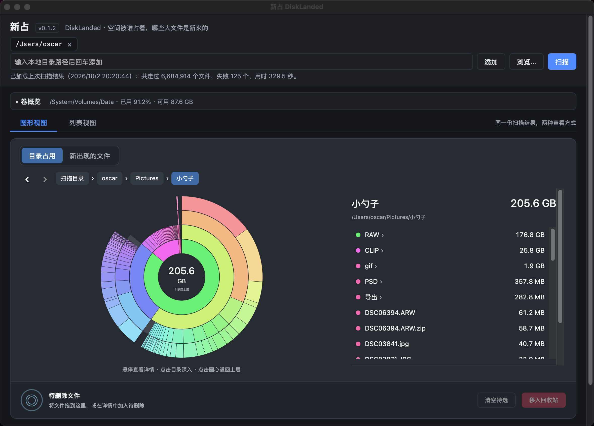
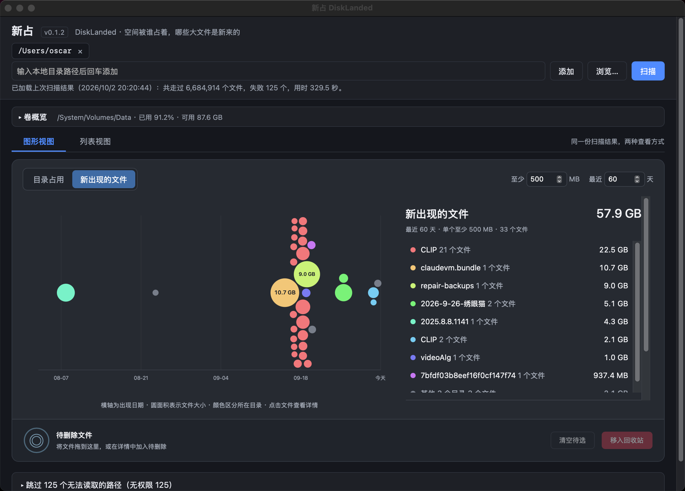
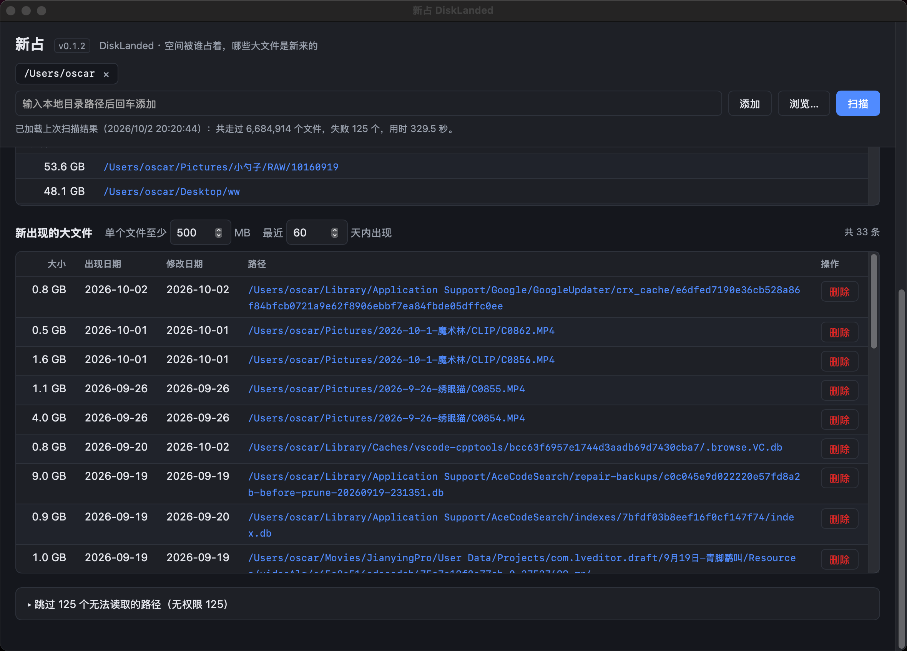

# 新占 DiskLanded

新占是一款跨平台磁盘空间分析工具，支持 macOS（Intel / Apple Silicon）、Windows x64 和 Linux x64，回答两件事：

1. 磁盘空间被哪些目录占着；
2. 哪些大文件是最近才出现在这台机器上的。

通过目录占用环形图、最近文件时间线和明细列表，找到占空间的目录与近期新增的大文件，并将选中的文件移入系统回收站。

Go 负责扫描和业务逻辑，界面用 Wails v2（系统 WebView），界面文字为简体中文。扫描只读取元数据，不读取文件内容，不上传、不请求管理员权限；不支持永久删除或删除目录。

## 快速上手

1. 启动应用，首次默认选择当前用户主目录；可输入本地目录路径后点「添加」，或通过「浏览…」选择多个扫描目录。
2. 点击「扫描」，查看进度和当前路径；需要时可点击「取消」，保留已扫描的部分结果。
3. 在「目录占用」中逐层查找大目录，或切换到「新出现的文件」，调整文件大小和最近天数；需要完整路径及日期时，切换到「列表视图」。
4. 点击文件查看详情并定位，确认后单独删除，或加入「待删除文件」区统一移入回收站。完成后重新扫描，更新目录占用。

应用会自动保存上次扫描结果，下次启动即可继续查看；缓存展示的是上次扫描时的状态。

## 功能与界面

默认打开「图形视图」，点击页签可切换到「列表视图」，两种视图使用同一份扫描结果。以下为 macOS 界面截图。

### 目录占用：逐层找到空间去向



- **环形目录图**：扇区越宽，分配占用越大；由内向外表示目录层级，采用连续彩虹配色，外层逐渐变亮。
- **逐层浏览**：悬停查看详情并联动右侧明细，点击目录进入下一层；点击圆心返回上层，也可通过面包屑、前进和后退按钮导航。
- **分层展示**：每次最多展示四层，进入目录后继续展开更深层级。目录层级来自完整扫描结果，不受大目录列表阈值和 2,000 行上限影响。
- **占用不重复累计**：小文件、目录元数据和合并显示的项目归入深灰色「其他项目」。图形总量仅代表扫描目录的占用，不包含未扫描的磁盘空间。

### 新出现的文件：按时间发现近期大文件



- **时间线气泡图**：横轴为出现日期，越靠右越新；圆面积表示文件的分配大小，颜色区分所在目录。气泡密集时会缩小或错开，具体日期可在文件详情中查看。
- **大小与日期筛选**：默认查看单个文件至少 500 MB、最近 60 天内出现的文件，筛选条件与列表视图同步，调整时无需重新扫描。
- **目录汇总**：右侧按所在目录汇总文件数量和占用；目录较多时，保留占用最大的目录，其余合并显示。
- **显示范围**：最多读取符合条件的最新 2,000 个文件，从中选取最大的 300 个绘制气泡；汇总基于已读取的文件，界面提示匹配数和显示范围。
- **文件详情**：点击气泡可查看完整路径、大小、出现日期和修改日期，并执行定位、加入待删除或删除。

### 列表视图：查看路径、日期与占用明细



| 列表 | 默认筛选 | 排序与内容 |
| --- | --- | --- |
| 大目录 | 分配占用至少 1 GB，可调整 | 按占用从大到小，显示大小与完整路径 |
| 新出现的大文件 | 单个至少 500 MB，最近 60 天内，可调整 | 按出现日期从新到旧，显示大小、出现日期、修改日期、路径和删除按钮 |

每张列表最多显示 2,000 行，超过时显示匹配总数与当前显示条数。大小默认使用分配大小（实际占用块数）；与逻辑大小相差至少 10% 且至少 10 MB 时，额外显示逻辑大小。悬停大小单元格可看两者的精确字节数。

「出现日期」以文件系统提供的时间为准：macOS 使用 birth time，Windows 使用 creation time；Linux 使用 `statx` 的 birth time，无法获取时改用修改时间，并标注「修改时间」。

点击列表路径或图形详情中的「定位」，可在系统文件管理器中显示文件：macOS 使用 Finder，Windows 使用资源管理器；Linux 打开文件所在目录。对目录路径则在文件管理器中显示或打开该目录。

### 右键菜单

图形中的文件、目录、右侧明细，列表视图中的文件与目录，以及待删除区中的文件，均可通过右键菜单操作：

- **文件**：加入或移出待删除、在文件管理器中显示、复制路径。在列表中加入待删除后，可到图形视图底部统一回收。
- **新文件的目录汇总**：将该组已读取的新文件一次加入待删除，仍受当前大小、日期筛选和读取范围限制。
- **目录**：在图形中查看或进入、在文件管理器中显示、复制路径；「加入待删除」不可用，目录本身不能删除。

### 待删除文件与系统回收站

- 可从图形中的文件扇区、气泡或文件明细拖入底部「待删除文件」区，也可点击详情中的「加入待删除」。待选区显示文件数量与总大小，可移除单项或「清空待选」。
- 拖动文件时显示抓取光标和跟随的文件名标签；进入待删除区后显示「复制」光标及「松开加入待删除」提示。
- 加入待删除只建立待选列表，点击「移入回收站」后才逐个回收；也可通过文件详情或列表行的「删除」按钮直接回收单个文件。
- macOS 移入废纸篓，Windows x64 移入回收站，Linux 使用 `gio trash`。仅支持已扫描的普通文件，扫描中暂停删除；失败时显示错误，不回退到永久删除，也不删除目录。
- 批量回收失败的文件保留在待选区；重新扫描会清空待选。成功回收后更新文件结果、卷概览和缓存，可在系统回收站恢复文件。
- **目录占用仍是扫描时的快照**，回收或恢复文件后需要重新扫描才能更新。

### 卷概览

展示扫描目录所在卷的总容量、已用、可用和占用百分比（十进制 GB，保留一位小数；百分比 = 已用 / 总容量）。图形视图默认收起详细容量卡片，点击可展开；列表视图默认展开。卷概览反映整个卷的容量，与仅统计所选目录的环形图范围不同。


## 扫描规则

- 默认扫描根为当前用户主目录，可添加任意本地目录（输入路径或「浏览…」）。同一文件系统上嵌套的扫描根会合并，避免重复计数。
- 可取消；进行中显示已走过的文件数和当前路径。
- 无权限、被占用、已删除的路径跳过并计数，结束后列出分类计数和前 500 条明细。
- 不跟随符号链接；Windows 上不进入 junction、目录符号链接和卷挂载点。
- 不进入另一块挂载的文件系统（按设备号判断），除非该挂载点本身被选为扫描根。
- 硬链接的文件只计一次（Windows 上只对 ≥1 MB 的文件按文件 ID 去重）。
- 结果包含全部目录的汇总，以及分配大小 ≥1 MB 的文件。因此文件阈值最低 1 MB，调整阈值无需重新扫描。
- 扫描结束后自动将结果压缩缓存到系统用户缓存目录下的 `DiskLanded/last-scan.json.gz`（macOS 为 `~/Library/Caches`，Windows 为 `%LocalAppData%`，Linux 为 `$XDG_CACHE_HOME` 或 `~/.cache`），下次启动自动恢复扫描根、目录、文件和失败明细，并显示原扫描时间。取消扫描的部分结果也会缓存并标注不完整。
  - 缓存仅包含扫描元数据，不包含文件内容。写入完成后才替换旧缓存；缓存缺失时正常启动，损坏或写入失败时显示提示，仍可重新扫描。
  - 文件成功移入回收站后同步更新缓存。恢复的目录占用仍为上次扫描的快照，需重新扫描更新；卷概览在启动时重新读取。
- 扫描不修改时间戳：只做 `fstatat`/`statx`/目录枚举，不打开文件；Linux 以 `O_NOATIME` 打开目录（仅对自己拥有的目录有效）。用户主动删除时由系统回收接口执行移动，不手动设置时间戳。

## 构建

本地构建需要 Go（版本见 `go.mod`），并将 `go` 加入 `PATH`。macOS 还需要 Xcode Command Line
Tools（可用 `xcode-select --install` 安装）；Windows 可使用系统自带的 Windows PowerShell 5.1。

在仓库根目录运行：

```sh
# macOS：Intel / Apple Silicon 通用应用，生成 build/bin/DiskLanded.app
./build-mac.sh
```

```powershell
# Windows x64：生成 build\bin\DiskLanded.exe（PowerShell 或 cmd 均可运行）
.\build-win.cmd
# 也可直接在 PowerShell 中运行
powershell.exe -NoProfile -ExecutionPolicy Bypass -File .\build-win.ps1
```

脚本自动定位仓库目录，支持含空格的路径，也可从其他目录用脚本路径启动。通过 `go run` 使用
`go.mod` 指定版本的 Wails CLI，无需提前安装 CLI；首次运行需要联网下载 Go 依赖，后续复用 Go
缓存。构建失败返回非零退出码。Windows 启动脚本只为本次进程设置执行策略。

如需手动构建（含 Linux），先安装 Wails CLI：

```sh
go install github.com/wailsapp/wails/v2/cmd/wails@v2.16.0

# macOS（生成 build/bin/DiskLanded.app）
wails build -skipbindings -platform darwin/universal
# Windows（生成 build\bin\DiskLanded.exe）
wails build -skipbindings -platform windows/amd64
# Linux（需要 libgtk-3-dev、libwebkit2gtk-4.1-dev；生成 build/bin/DiskLanded）
wails build -skipbindings -tags webkit2_41
```

前端是 `frontend/dist` 下的纯 HTML/CSS/JS，无需 npm。

运行时依赖：Windows 需要 WebView2（Windows 11 和更新过的 Windows 10 自带）；Linux 需要系统的 WebKitGTK 4.1（`libwebkit2gtk-4.1-0`，主流桌面发行版默认安装）。

## 版本与发布

版本号只在根目录 `VERSION` 维护，编译时嵌入，显示在窗口顶部「新占」旁（如 `v0.1`）。
CI 根据它生成安装包的版本元数据，不需要手动同步 `wails.json`。版本支持 `0.1` 或 `0.1.1`
这样的两段、三段数字，每段不超过 65535。

版本制作机制参考 [CodeSearch](https://github.com/OscarKing888/CodeSearch)，bump 脚本需要
Node.js 22 或更新版本及 Git。可从任意分支的 worktree 运行，脚本会定位到同一仓库中检出
`main` 的 worktree；如果没有检出 `main`，会停止并提示先检出，不自动切换调用方分支：

```sh
# macOS / Linux
./bump-version.sh 0.1.1 --notes "本次版本的更新说明"
```

```bat
:: Windows x64，PowerShell 也可运行
.\bump-version.bat 0.1.1 --notes "本次版本的更新说明"
```

`scripts/bump-version.js` 校验参数和仓库状态，直接在 `main` 的 worktree 更新 `VERSION` 和
`CHANGELOG.md`；`bump-version.sh` / `.bat` 随后直接用 Git 命令只提交这两个文件，在该 `main`
提交上创建附注 Tag `v0.1.1`，再用 `git push --atomic origin main v0.1.1` 一起推送 `main`
和 Tag（两者要么都成功，要么远端都不变）。不创建临时分支或 worktree，所有操作使用仓库级锁
串行执行。它保留调用方的分支和改动，以及 `main` 上无关的暂存或未提交内容；自动提交时，
版本文件有未提交修改会停止。已有 Tag 不会被覆盖。格式检查失败会显示具体文件和行号；Git
提交失败会显示 Git 的实际错误。两种失败都会保留 `main` 上的版本文件修改，修正错误并检查
这两个文件后，可加 `--resume` 继续提交。Tag 创建失败保留版本提交，修复后可用同一版本重试。
推送失败（例如远端 `main` 有新提交）保留本地提交和 Tag；把 `origin/main` 合入 `main` 后，
用同一版本重新运行即可推送，不会再次提交或改动 Tag。

- `--notes` 可重复使用；`--date YYYY-MM-DD` 指定更新记录日期。
- `--no-tag` 在 `main` 提交版本变更并推送 `main`，不创建或推送 Tag。
- `--no-push` 只在本地提交并打 Tag，不推送；之后用同一版本不带该参数重新运行即可推送。
- `--no-commit` 同样只修改 `main` worktree 的版本文件，不提交、打 Tag 或推送；不支持无 Git
  仓库的源码压缩包。检查并验证后可用 `--resume` 完成提交、Tag 和推送。
- `--resume` 继续当前未完成的版本制作，要求 `VERSION` 和已有 CHANGELOG 版本标题均匹配
  指定版本；保留现有说明并修正文件末尾多余空行。不能与 `--notes` 或 `--no-commit` 合用，
  不会覆盖已有 Tag 或夹带其他暂存文件。版本不能低于 `main` 已提交的版本。

例如，旧脚本留下了 `0.1.1` 的未提交文件，或先前使用了 `--no-commit`，检查内容后执行：

```sh
./bump-version.sh 0.1.1 --resume
# Windows：.\bump-version.bat 0.1.1 --resume
```

推送版本 Tag 会触发 CI 发布，运行前请先检查更新说明并完成本地构建验证；需要先在本地检查
提交时使用 `--no-push`。

`.github/workflows/build.yml` 只在推送 `v*` Tag 或手动触发时运行。CI 校验 Tag 等于
`v` + `VERSION`，执行脚本和前端测试，再在三种系统上执行 Go 测试、构建及启动检查。
推送 Tag 后自动创建 GitHub Release，附上对应版本的 CHANGELOG、GitHub 生成的更新说明及：

- `DiskLanded-v<版本>-macos-universal.zip`：Intel / Apple Silicon 通用 `.app`。
- `DiskLanded-v<版本>-windows-x64.zip`：Windows x64 `.exe`。
- `DiskLanded-v<版本>-linux-x64.tar.gz`：Linux x64 可执行文件。
- `SHA256SUMS.txt`：三个安装包的 SHA-256 校验值。

手动选择分支运行 Action 时仅生成可下载的构建产物；选择版本 Tag 时也会发布该版本。
已发布的 Tag 不移动或重打；发布修复时使用新版本号。

## 协作流程

每次修改使用独立 worktree 与 `session/*` 分支，验证后自动合并到 `main`，详见
`.codex/rules/feature-branch-merge.md`。

## 测试

```sh
go test ./internal/...                                          # 单元测试
node --test frontend/graph.test.cjs scripts/*.test.cjs             # 图形、版本制作及打包校验（需要 Node.js 22+）
DISKLANDED_HOME_SCAN=1 go test -v -run TestHomeScan ./internal/scan   # 扫描真实主目录
DISKLANDED_GUI=1 go test -v ./internal/reveal                    # 在 Finder / 资源管理器中实际定位文件
```

权限测试在 Unix 上需要以非 root 用户运行。`.github/workflows/build.yml` 在推送版本 Tag 时于三种系统上执行以上测试、构建并启动应用。

图形悬停性能可使用 `frontend/graph-benchmark.html` 检查：在仓库根目录运行
`python3 -m http.server 8764 --bind 127.0.0.1`，浏览器打开
`http://127.0.0.1:8764/frontend/graph-benchmark.html`，点击「运行 240 帧测试」。
页面使用真实图形组件与 1,194 个模拟扇区，输出帧间隔、事件处理耗时和 DOM 修改次数；
不扫描或修改真实文件。比较版本时使用相同浏览器和窗口大小，并保持页面在前台。
悬停按显示帧合并更新，高亮通过分支引用绘制；同一扇区内移动不会重建详情或反复测量提示框。
